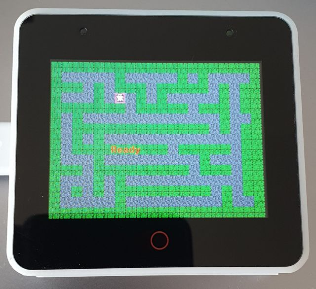

# esp32-spooky-maze-game

Spooky Maze is simple game where ghost is located in the maze. The goal is to collect 100 coins.
The ghost can find artifact "Walker" which allows him to pass throght the wall for limited period of time.
The ghost can use dynamite to clear wall in the vicinity. The ghost can use also Teleport spell to move to random place in the maze.
The Teleport spell requires some time to recharge. There are some not friendly spirits running around the maze, when collision occurs the ghost is teleported and loses five coins which are then send randomly back to the maze.

## Build and flash

### Build WASM version

```
cd wasm
npm install
npm run serve
```

Open in web browser: http://localhost:8080

### Build for ESP32-S3-BOX with ILI9486



Control: IMU
- tilt the board to move the character
- move quickly up to teleport
- move quickly down to place dynamite and destroy walls around

```
cd esp32-s3-box
cargo espflash --release --monitor
```

#### Features

- Embedded Graphics
- Framebuffer
- Random maze generator
- IMU Accelerometer control

### Build for dekstop

Control: keyboard
- press arrows or W,A,S,D to move the character
- press Enter to teleport

- macOS prerequisites:
```
brew install SDL2
export LIBRARY_PATH="$LIBRARY_PATH:$(brew --prefix)/lib"
```

- OpenSUSE Linux prerequisites:
```
sudo zypper install SDL2-devel
```

- run:
```
cd desktop
cargo run
```


### Build for ESP32-S3-USB-OTG with ST7789


Control: buttons
- press button to move the character
- press up & down to teleport
- press ok & menu to place dynamite

```
cd esp32-s3-usb-otg
esp32-s3-usb-otg
```

### Build for ESP32-S2-USB-OTG with ST7789

Control: buttons
- press button to move the character
- press up & down to teleport
- press ok & menu to place dynamite

```
cd esp32-s2-usb-otg
esp32-s2-usb-otg
```

### Build for M5CORE-FIRE with ESP32 and ILI9341

HW: https://docs.makerfactory.io/m5stack/core/fire/

Control: MPU-9250
- tilt the board to move the character
- move quickly up to teleport
- move quickly down to place dynamite and destroy walls around

```
cd m5core-fire
cargo espflash --release --monitor
```

### Build for ESP32 Wrover Kit

See tag v0.1.0.

```
cargo espflash --release --target xtensa-esp32-none-elf --features esp32_wrover_kit --monitor
```

### Build for ESP32-S2 with ILI9341

See tag v0.1.0.

```
cargo espflash --release --target xtensa-esp32s2-none-elf --features esp32s2_ili9341 --monitor
```


### Build for ESP32-C3 with ILI9341

See tag v0.1.0.

It's necessary to override default toolchain specified in `rust-toolchain.toml`. One option is to pass `+nightly` to command line.

```
cargo +nightly espflash --release --target riscv32imac-unknown-none-elf --features esp32c3_ili9341 --monitor
```

## Development

Following steps are useful for IDE integration, so that IDE can recognize which is your current target and fature set.

Check `target` configurad in the file `.cargo/config.toml`.
It should be one of following values:
```
target = "xtensa-esp32-none-elf"
target = "xtensa-esp32s2-none-elf"
target = "xtensa-esp32s3-none-elf"
target = "riscv32imac-unknown-none-elf"
```

If no value is selected, make sure to specify target on command line.

Check default `features` in `Cargo.toml`. Make sure that default set contains your board and display combinations.

If no value is selected, make sure to specify features on command line.

