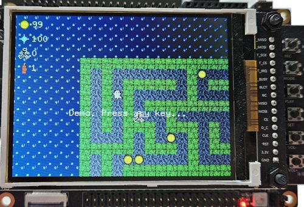
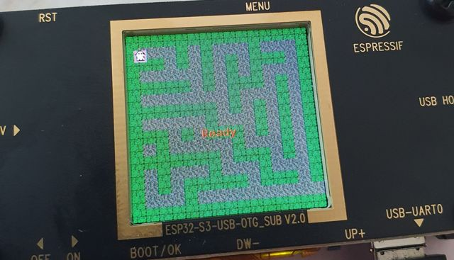

# esp32-spooky-maze-game

[](https://wokwi.com/projects/380658681618693121)

Spooky Maze is simple game where ghost is located in the maze. The goal is to collect 100 coins.
The ghost can find artifact "Walker" which allows him to pass throght the wall for limited period of time.
The ghost can use dynamite to clear wall in the vicinity. The ghost can use also Teleport spell to move to random place in the maze.
The Teleport spell requires some time to recharge. There are some not friendly spirits running around the maze, when collision occurs the ghost is teleported and loses five coins which are then send randomly back to the maze.



## Flashing binary from Releases

Binaries are available in [GitHub Releases](https://github.com/georgik/esp32-spooky-maze-game/releases).

Binaries can be flashed by:
  - GUI [esp-helm](https://github.com/georgik/esp-helm)
  - CLI [espflash](https://github.com/esp-rs/espflash) `espflash write-bin 0x0 spooky-maze-esp-wrover-kit.bin`
  - Web browser (experimental) [ESP-Launchpad](https://georgik.rocks/wp-content/html5/esp-launchpad/?flashConfigURL=https://georgik.rocks/wp-content/esp32/esp32-spooky-maze-game/esp-launchpad.toml).

## IDE support

### CLion

Recommendation: Open only sub-directory with specific target with specific toolchain in CLion, because only one toolchain is supported for resolving code dependencies. Opening whole workspace works, just some code dependencies might not be resolved. This is also limitation of cargo, which supports only one toolchain per build.

## Build and flash

Install `espflash` which is required to flash and monitor the app on Embedded Device:

```
cargo install espflash
cargo install cargo-espflash
```

Enter the directory with project and build it:

```
cd esp-wrover-kit
cargo build --release
```

### Build binaries for all targets

The script builds all possible targets: support/ci/build-esp32-firmware.sh

## Wokwi simulation in VS Code

Open subdirectory with target in VS Code with installed Wokwi Extension. Select `Wokwi: Start Simulator`.

### Build WASM version

```
cd wasm
npm install
npm run serve
```

Open in web browser: https://localhost:8443.

Note: https is required for access to accelerometer data - https://w3c.github.io/deviceorientation/#security-and-privacy . It's possible to run the app without accelerometer on http.

## Implemented technologies

Each directory contains implementation specific for the HW.

Overview:

| Name                 | Chip     | Display  | Controls                              | PMU     |
|----------------------|----------|----------|---------------------------------------|---------|
| esp-wrover-kit       | esp32    | ili9341  | 6 push-button controls, separate PINs |         |
| esp32-c3-devkit-rust | esp32-c3 | st7789   | icm42670 accelerometer                |         |
| esp32-c3-lcdkit      | esp32-c3 | gc9a01   | rotary encoder                        |         |
| esp32-c6-devkit      | esp32-c6 | ili9341  | resistor ladder with push buttons     |         |
| esp32-s2-kaluga      | esp32-s2 | ili9341  | resistor ladder with push buttons     |         |
| esp32-s3-box         | esp32-s3 | ili9342c | icm42670 accelerometer                |         |
| esp32-s3-box-lite    | esp32-s3 | st7789   | no controls                           |         |
| esp32-s3-usb-otg     | esp32-s3 | st7789   | 5 push-buttons on the board           |         |
| m5stack-core2        | esp32    | ili9341  | mpu6886 accelerometer                 | AXP192  |
| m5stack-fire         | esp32    | ili9342c | mpu9250 accelerometer                 | AXP2101 |


### Build for ESP32-S3-BOX with ILI9486


Control: IMU
- tilt the board to move the character
- move quickly up to teleport
- move quickly down to place dynamite and destroy walls around

```
cd esp32-s3-box
cargo run --release --monitor
```

### Build for ESP32-C3-DeviKit-RUST with ILI9341

Control: IMU
- tilt board to move character

```
cd esp32-c3-devkit-rust
cargo run --release --monitor
```

#### Features

- Embedded Graphics
- Framebuffer
- Random maze generator
- IMU Accelerometer control

### Build for dekstop

Control: keyboard
- press arrows or W,A,S,D to move the character
- press Enter to teleport

- macOS prerequisites:
```
brew install SDL2
export LIBRARY_PATH="$LIBRARY_PATH:$(brew --prefix)/lib"
```

- OpenSUSE Linux prerequisites:
```
sudo zypper install SDL2-devel
```

- run:
```
cd desktop
cargo run
```

### Build for ESP32-S3-USB-OTG with ST7789



Control: buttons
- press button to move the character
- press up & down to teleport
- press ok & menu to place dynamite

```
cd esp32-s3-usb-otg
cargo run --release --monitor
```

### Build for M5Stack-FIRE with ESP32 and ILI9341

HW: https://docs.makerfactory.io/m5stack/core/fire/

Control: MPU-9250, buttons
- tilt the board to move the character
- move quickly up or press button C to teleport
- move quickly down or press button B to place dynamite and destroy walls around

```
cd m5stack-fire
cargo run --release --monitor
```

#### Build M5Stack-FIRE using GitPod.io and run with Wokwi

- Open in [GitPod.io](https://gitpod.io/github.com/georgik/esp32-spooky-maze-game)

```
cd m5stack-fire
./run-wokwi.sh
```

- Wokwi project: https://wokwi.com/projects/350825213595746900

#### Build M5Stack-FIRE using Codespaces and run with Wokwi

- Navigate to [GitHub repository](https://github.com/georgik/esp32-spooky-maze-game)
- Click Open, select Codespaces tab, click Create Codespace

```
cd m5stack-fire
./run-wokwi.sh
```

#### Build M5Stack-FIRE and run Wokwi in local VS Code

Preview: install VS Code Wokwi plugin (private beta available on request)

```
cd m5stack-fire
cargo build --release --no-default-features --features "wokwi"
```

Press F1, select Wokwi: Start simulation

### Build for M5Stack-Core2 with ESP32 and ILI9342C

HW: https://shop.m5stack.com/products/m5stack-core2-esp32-iot-development-kit?variant=35960244109476

Control: MPU6886
- tilt the board to move the character
- move quickly up or press button C to teleport
- move quickly down or press button B to place dynamite and destroy walls around

```
cd m5stack-core2
cargo run --release --monitor
```

### Build for ESP32-S2-Kaluga v1.3

HW: https://docs.espressif.com/projects/esp-idf/en/latest/esp32/hw-reference/esp32/get-started-wrover-kit.html

Control: buttons (partialy implemented based on of https://github.com/espressif/esp-bsp/blob/master/esp32_s2_kaluga_kit/esp32_s2_kaluga_kit.c#L59)
- more details https://github.com/espressif/esp-bsp/blob/master/esp32_s2_kaluga_kit/include/bsp/esp32_s2_kaluga_kit.h#L299
- K3-K6 to move the character
- (not supported) press K5 button to teleport
- (not supported) press K6 button to place dynamite

```
cd esp32-s2-kaluga
cargo run --release --monitor
```

Note for older version 1.2 - GPIO6 is used to control backlight.

### Build for ESP32-C6-DevKitM-1

HW: https://docs.espressif.com/projects/espressif-esp-dev-kits/en/latest/esp32c6/esp32-c6-devkitc-1/index.html

Important: Requires `espflash 2.x` - install with `cargo install espflash --git https://github.com/esp-rs/espflash.git`

Controls: not implemented

```
cd esp32-c6-devkit
cargo espflash flash --release --monitor
```

### Build for ESP Wrover Kit

HW: https://docs.espressif.com/projects/esp-idf/en/latest/esp32/hw-reference/esp32/get-started-wrover-kit.html

Control: 6 push buttons
- it's not possible to move the character
- press button Boot to teleport

```
cd esp-wrover-kit
cargo run --release --monitor
```

## Development

Following steps are useful for IDE integration, so that IDE can recognize which is your current target and fature set.

Check `target` configurad in the file `.cargo/config.toml`.
It should be one of following values:
```
target = "xtensa-esp32-none-elf"
target = "xtensa-esp32s2-none-elf"
target = "xtensa-esp32s3-none-elf"
target = "riscv32imac-unknown-none-elf"
```

If no value is selected, make sure to specify target on command line.

Check default `features` in `Cargo.toml`. Make sure that default set contains your board and display combinations.

If no value is selected, make sure to specify features on command line.

