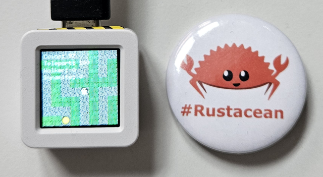

# ESP32 Spooky Maze Game


ESP32 Spooky Maze Game is a technical demo game built using [Bevy ECS 0.16.1](https://github.com/bevyengine/bevy) 
with no_std support via [esp-hal 1.0.0-beta.1](https://github.com/esp-rs/esp-hal). The game demonstrates how to 
build cross-platform applications that run on both embedded hardware and desktop environments using a shared core.

In this game, a ghost navigates through a maze collecting coins while avoiding obstacles. Special artifacts such as
dynamite and the "walker" power-up introduce additional gameplay mechanics. On collision with various objects, events
are dispatched to decouple hardware-specific logic from game rules.

<video src="https://github.com/user-attachments/assets/28ef7c2b-42cc-4c79-bbdb-fcb0740bf533" controls width="320">
View the video [here](https://github.com/user-attachments/assets/28ef7c2b-42cc-4c79-bbdb-fcb0740bf533).
</video>


## Targets

For now, the project supports three primary targets:

- **Desktop Rust Standard Version**
  Use keyboard controls to move the ghost and trigger actions.
 
  

- **WebAssembly (WASM) Version**
  Play the game directly in your browser using WebAssembly. Features the same gameplay as the desktop version with both keyboard and mouse controls.

- **[ESP32-S3-BOX-3](https://github.com/espressif/esp-box) Embedded Version**
  Uses an ICM42670 accelerometer for input (tilt the board to move the ghost).

  

- **[M5Stack-Atom-S3](https://docs.m5stack.com/en/core/AtomS3) Embedded Version**
  Uses an MPU6886 accelerometer for input (tilt the board to move the ghost).

  


Note: For older targets (e.g., ESP32-C3, ESP32-S2, etc.), please refer to the 
[v0.10.0 tag](https://github.com/georgik/esp32-spooky-maze-game/tree/v0.10.0).

## Recommended Tools

- [CLion with Rust and Wokwi plugins](https://plugins.jetbrains.com/plugin/23826-wokwi-simulator)
- [VS Code with Rust and Wokwi plugin](https://docs.wokwi.com/vscode/getting-started)

## Technical Specifications

### Hardware Requirements

- **ESP32-S3-BOX-3**: 8MB PSRAM, ICM42670 accelerometer, 320x240 ILI9486 display
- **M5Stack-Atom-S3**: 180KB internal RAM (no PSRAM), MPU6886 accelerometer, 130x129 GC9A01 display

### Software Versions

- **Bevy ECS**: 0.16.1 (with minimal plugin configuration for embedded)
- **esp-hal**: 1.0.0-beta.1
- **Rust Edition**: 2024
- **Target**: xtensa-esp32s3-none-elf

### Memory Management

- **ESP32-S3-BOX-3**: Uses PSRAM allocator for large framebuffer (320x240x2 = 153,600 bytes)
- **M5Stack-Atom-S3**: Uses internal RAM heap allocator (180KB) for small framebuffer (130x129x2 = 33,540 bytes)
- **Event Processing**: Minimal Bevy plugins (TaskPoolPlugin, TimePlugin, ScheduleRunnerPlugin) 
  to enable event processing without memory overhead of DefaultPlugins

## Key Technical Decisions

- Bevy ECS & no_std:
  The core game logic is implemented in spooky-core using Bevy ECS. For the embedded version, we use a no_std
  configuration along with esp-hal.
- Renderer & HUD on Embedded:
  Since Bevy’s built-in rendering and UI systems aren’t available in no_std mode, we’ve implemented our own renderer
  using the Embedded Graphics crate. This renderer also handles HUD text output using Embedded Graphics primitives.
- Event-based Architecture:
  Input events (whether from keyboard on desktop or accelerometer on embedded) are dispatched and processed by separate
  systems, allowing for a clean decoupling between hardware input and game logic.
- Hardware Peripheral Integration:
  Peripherals like the ICM42670 accelerometer are injected as Bevy resources (using NonSend where required), enabling
  seamless access to hardware data within ECS systems.
- Random Maze Generation:
  The maze is generated dynamically, with a seed provided as a resource to ensure variability across game sessions. For
  the embedded version, the seed is generated using the hardware RNG and passed into the maze generation logic.

## Build and Run Instructions

### Desktop Version

Prerequisites:

- Rust

Build:

```shell
cd spooky-maze-desktop
cargo run
```

Controls:

Movement: Arrow keys

### WebAssembly (WASM) Version

Prerequisites:

- Rust
- wasm-pack (installed automatically by build script)

Build and run:

```shell
cd spooky-maze-wasm
./build.sh
# Then serve with any HTTP server:
python3 -m http.server 8000
# Open http://localhost:8000 in your browser
```

Controls:

- Movement: Arrow keys or WASD
- Teleport: Space key
- Place Dynamite: Enter key
- Alternative: Use on-screen buttons for all actions

### Embedded Version

#### ESP32-S3

These instructions are valid for boards based on ESP32-S3:
- ESP32-S3-BOX-3
- M5Stack-Atom-S3

Prerequisites:

espflash installed:

```
cargo install espflash
```

Rust [Xtensa toolchain](https://github.com/esp-rs/rust-build) installed:
```shell
cargo install espup
espup install
```

Compiler toolchain from ESP-IDF v5.5 (required only for Xtensa targets):
```shell
git clone git@github.com:espressif/esp-idf.git --depth 10 --recursive --shallow-submodules 
source esp-idf/export.sh
```

Properly configured ESP32-S3-BOX-3 hardware

Build and run:

- ESP32-S3-BOX-3
```shell
cd spooky-maze-esp32-s3-box-3
cargo run --release
```
- M5Stack-Atom-S3
```shell
cd spooky-maze-m5stack-atom-s3
cargo run --release
```

Controls:

Movement: Tilt the board accelerometer

## Differences of Embedded Bevy no_std from Classical Bevy std

- Embedded Renderer:
  The embedded version uses a custom renderer built with Embedded Graphics. This renderer handles both drawing the maze
  and HUD, filtering out a specific “magic pink” color used to represent transparent pixels in sprites.
- Peripheral Resources:
  Hardware peripherals like the accelerometer are injected as Bevy resources (using NonSend), enabling the decoupling of
  hardware interactions from game logic.
- Event-driven Input:
  Input events are dispatched and processed by ECS systems, allowing for a unified event-driven architecture across both
  desktop and embedded platforms.

## Contributing

Contributions are welcome! If you'd like to help improve the game, add new features, or adapt the project to additional
hardware targets, please feel free to submit a pull request. We especially welcome contributions that help improve the
no_std integration with Bevy ECS or enhance the embedded graphics rendering.

For more information on embedded development with ESP32, visit
the [Espressif Developer Portal](https://developer.espressif.com).

## IDE support

### Rust Rover

Recommendation: Open whole project and attach to particular Cargo.toml for specific target.

## License

This project is licensed under the MIT License. See LICENSE for details.
